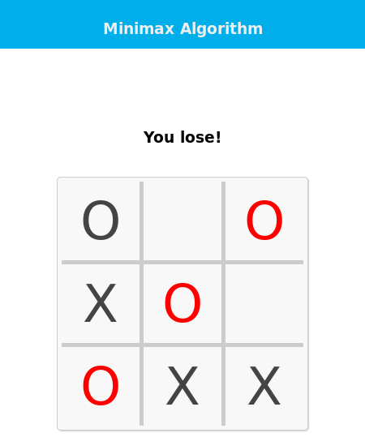

# Tic-Tac-Toe 3×3 với Minimax + Alpha–Beta, độ khó tùy chỉnh

Phiên bản refactor không dùng biến toàn cục, có type hints, UX hiển thị số ô, và **4 mức độ khó**: `easy`, `normal`, `hard`, `impossible`.

## Mục lục
- [Tính năng chính](#tính-năng-chính)
- [Cách chạy nhanh](#cách-chạy-nhanh)
- [Điều khiển và luật](#điều-khiển-và-luật)
- [Độ khó hoạt động thế nào](#độ-khó-hoạt-động-thế-nào)
- [Thuật toán](#thuật-toán)
- [Kiến trúc mã nguồn](#kiến-trúc-mã-nguồn)
- [So với bản gốc](#so-với-bản-gốc)
- [Phụ lục: README gốc](#phụ-lục-readme-gốc)

---

## Tính năng chính
- **Minimax + Alpha–Beta pruning**: tăng tốc duyệt cây so với minimax thuần.
- **Tie-break ưu tiên thắng sớm**: điểm số \(score = base \times (10 + depth)\). Thắng ở tầng cao được ưu tiên hơn.
- **Không dùng biến toàn cục**: gói vào lớp `TicTacToe` giúp test và tái sử dụng dễ hơn.
- **Hiển thị số 1..9 trên ô trống**: nhập liệu trực quan.
- **4 mức độ khó**:
  - `easy`: AI thường đi bừa, nhìn 1 lớp, không chiếm giữa khi mở màn.
  - `normal`: đôi lúc đi bừa, nhìn 3 lớp, không chiếm giữa.
  - `hard`: hiếm khi đi bừa, nhìn full, chiếm giữa khi hợp lý.
  - `impossible`: không đi bừa, nhìn full, luôn tối ưu.

## Cách chạy nhanh
```bash
python3 tictactoe_ab.py
```
Khi được hỏi, chọn độ khó: `easy | normal | hard | impossible` (mặc định `normal`).

## Điều khiển và luật
- Bàn 3×3. Bạn đánh **X**, AI **O** (mặc định). Có thể đổi thứ tự đi đầu/cuối khi khởi động.
- Nhập phím **1..9** tương ứng vị trí:
```
1 | 2 | 3
--+---+--
4 | 5 | 6
--+---+--
7 | 8 | 9
```
- Thắng khi có 3 ký hiệu liên tiếp theo **hàng/cột/chéo**.

## Độ khó hoạt động thế nào
AI dùng ba “điều tiết”:
1. **Xác suất đi bừa** `p_random`: tăng lên → AI dễ mắc lỗi.
2. **Giới hạn độ sâu** `depth_limit`: giảm xuống → AI nhìn ngắn hơn.
3. **Heuristic chiếm giữa** `use_center`: bật ở mức khó cao để tối ưu nước đầu.

| Mức | p_random | depth_limit | use_center |
|-----|----------|-------------|------------|
| easy | 0.60 | 1 | ✗ |
| normal | 0.20 | 3 | ✗ |
| hard | 0.05 | 9 | ✓ |
| impossible | 0.00 | 9 | ✓ |

> Gợi ý: muốn “cân” được AI, chơi `normal`. Muốn luyện phòng thủ tối ưu, chọn `impossible`.

## Thuật toán
- **Đánh giá**: +1 nếu AI thắng, −1 nếu người thắng, 0 nếu chưa phân định.
- **Tie-break theo độ sâu**: `score = evaluate(board) * (10 + depth)`
  - Thắng ở nhánh sâu hơn → điểm lớn hơn → **ưu tiên kết thúc sớm**.
  - Thua không tránh khỏi → chọn nhánh **kéo dài** để giảm điểm âm.
- **Alpha–Beta pruning**: cắt nhánh khi `beta ≤ alpha` để giảm số trạng thái cần duyệt.

Pseudo-code rút gọn:
```text
minimax_ab(board, depth, current, ai, alpha, beta):
  nếu depth == 0 hoặc game_over: trả điểm tie-break
  nếu current == ai:
    duyệt nước hợp lệ:
      đặt quân -> đệ quy -> hoàn lại
      cập nhật alpha và phương án tốt nhất
      nếu beta ≤ alpha: cắt
  ngược lại:
    tương tự nhưng tối thiểu hóa và cập nhật beta
```

## Kiến trúc mã nguồn
- `tictactoe_ab.py`:
  - Lõi: `minimax_alpha_beta(...)`, `evaluate`, `wins`, `empty_cells`.
  - Lớp `TicTacToe`: quản lý bàn cờ, render, nhập của người, lượt AI, kiểm tra trạng thái, và **độ khó**:
    - `_difficulty_params()` → `(p_random, depth_limit, use_center)`
    - `ai_move()` → áp dụng random-move, depth limit, center-heuristic.
- `minimax.py` (bản gốc): minimax thuần, nước đầu ngẫu nhiên, dùng biến toàn cục.

## So với bản gốc
- Thêm **Alpha–Beta**, **tie-break theo độ sâu**, **UX hiển thị số**, **mức độ khó**.
- Bỏ biến toàn cục, chuyển sang **class-based** để mở rộng dễ.
- Giữ tương thích bàn 3×3 và lối chơi cũ.

---

## Phụ lục: README gốc


Dưới đây là bản dịch tiếng Việt đầy đủ của README gốc, giữ nguyên **Minimax**, **Alpha–Beta**, **Tic‑Tac‑Toe**, tên repository, tên tác giả, hàm và biến trong code.

---

# tic-tac-toe-minimax
Một hiện thực thuật toán **Minimax** cho trò chơi **Tic‑Tac‑Toe** (còn gọi là Noughts and Crosses). Dùng thử: [Tic-tac-toe - Minimax](https://cledersonbc.github.io/tic-tac-toe-minimax/)

<p align="center">
	</img>
</p>

## Introduction
Để giải bài toán trò chơi bằng AI, ta giới thiệu khái niệm **game tree** rồi áp dụng **minimax**. Các trạng thái khác nhau của trò chơi được biểu diễn bởi các **node** trong game tree. Các node được sắp theo **level** tương ứng với lượt của từng người chơi. **Root** của cây (thường vẽ ở trên cùng) là vị trí bắt đầu của ván. Với tic‑tac‑toe, đó là lưới trống chưa có X hoặc O.

Ở dưới root, tại level thứ hai, là các trạng thái có thể có sau nước đi đầu tiên của người chơi thứ nhất, có thể là X hoặc O. Ta gọi các node này là **children** của root.

Mỗi node ở level thứ hai tiếp tục có các children là những trạng thái nhận được từ nước đi của người chơi đối phương. Quá trình này tiếp tục, level theo level, cho đến khi gặp trạng thái kết thúc ván. Với tic‑tac‑toe, tức là một người có đường 3 ký hiệu liên tiếp và thắng, hoặc bàn cờ đầy và ván **hòa**.

## What is Minimax?
**Minimax** là một phương pháp trí tuệ nhân tạo áp dụng cho các trò chơi hai người như tic‑tac‑toe, checkers, chess và go. Đây là các trò **zero‑sum**: biểu diễn toán học là một người thắng (**+1**), người kia thua (**−1**), hoặc cả hai đều không thắng (**0**).

## How does it works?
Thuật toán **tìm kiếm đệ quy** nước đi tốt nhất dẫn người chơi *Max* đến chiến thắng hoặc ít nhất không thua (**draw**). Nó xét trạng thái hiện tại và mọi nước hợp lệ tại trạng thái đó, sau đó với mỗi nước hợp lệ sẽ “đánh thử” (luân phiên *min* và *max*) cho đến khi gặp trạng thái **terminal** (win, draw hoặc lose).

## Understanding the Algorithm
Thuật toán được trình bày trong sách *Algorithms in a Nutshell* (George Heineman; Gary Pollice; Stanley Selkow, 2009). Pseudocode (được điều chỉnh):

```
minimax(state, depth, player)

	if (player = max) then
		best = [null, -infinity]
	else
		best = [null, +infinity]

	if (depth = 0 or gameover) then
		score = evaluate this state for player
		return [null, score]

	for each valid move m for player in state s do
		execute move m on s
		[move, score] = minimax(s, depth - 1, -player)
		undo move m on s

		if (player = max) then
			if score > best.score then best = [move, score]
		else
			if score < best.score then best = [move, score]

	return best
end
```

Bây giờ ta sẽ xem từng phần của pseudocode với hiện thực Python. Mã Python có trong repository này. Trước hết, giả sử:

> board = [
>	[0, 0, 0],
>	[0, 0, 0],
>	[0, 0, 0]
> ]

> MAX = +1

> MIN = -1

`MAX` có thể là `X` hoặc `O` và `MIN` có thể là `O` hoặc `X`. Bàn cờ là 3x3.

```python
def minimax(state, depth, player):
```
* **state**: bàn cờ hiện tại trong tic‑tac‑toe (node)
* **depth**: chỉ số của node trong game tree
* **player**: có thể là *MAX* hoặc *MIN*

```python
if player == MAX:
	return [-1, -1, -infinity]
else:
	return [-1, -1, +infinity]
```

Cả hai người chơi bắt đầu với điểm tệ nhất của mình. Nếu người chơi là `MAX` thì điểm là `-infinity`. Nếu là `MIN` thì điểm là `+infinity`. **Lưu ý:** `infinity` là bí danh của `inf` (từ module `math` trong Python).

Nước đi tốt nhất trên bàn lúc này là `[-1, -1]` (hàng và cột) cho tất cả.

```python
if depth == 0 or game_over(state):
	score = evaluate(state)
	return score
```

Nếu `depth == 0` thì bàn cờ không còn ô trống để đánh. Hoặc nếu có người thắng thì ván đã kết thúc cho `MAX` hoặc `MIN`. Khi đó điểm cho trạng thái sẽ được trả về.

* Nếu `MAX` thắng: trả `+1`
* Nếu `MIN` thắng: trả `-1`
* Ngược lại: trả `0` (hòa)

Tiếp theo là phần chính chứa đệ quy:

```python
for cell in empty_cells(state):
	x, y = cell[0], cell[1]
	state[x][y] = player
	score = minimax(state, depth - 1, -player)
	state[x][y] = 0
	score[0], score[1] = x, y
```

Với mỗi nước hợp lệ (ô trống):
* `x`: nhận chỉ số hàng của ô
* `y`: nhận chỉ số cột của ô
* `state[x][y]`: đặt `MAX` hoặc `MIN` vào ô trống tương ứng
* `score = minimax(state, depth - 1, -player)`:
  * `state`: bàn cờ hiện tại trong đệ quy;
  * `depth - 1`: chỉ số của trạng thái kế tiếp;
  * `-player`: nếu người chơi hiện tại là `MAX` (`+1`) thì chuyển thành `MIN` (`-1`) và ngược lại.

Nước đi trên bàn được **hoàn lại** và ghi nhận lại tọa độ hàng, cột.

Bước tiếp theo là **so sánh** `score` với `best`:

```python
if player == MAX:
	if score[2] > best[2]:
		best = score
else:
	if score[2] < best[2]:
		best = score
```

Với người chơi `MAX`, điểm **lớn hơn** sẽ được chọn. Với `MIN`, điểm **nhỏ hơn** sẽ được chọn. Cuối cùng, nước đi tốt nhất được trả về. Thuật toán hoàn chỉnh:

```python
def minimax(state, depth, player):
	if player == MAX:
		best = [-1, -1, -infinity]
	else:
		best = [-1, -1, +infinity]

	if depth == 0 or game_over(state):
		score = evaluate(state)
		return [-1, -1, score]

	for cell in empty_cells(state):
		x, y = cell[0], cell[1]
		state[x][y] = player
		score = minimax(state, depth - 1, -player)
		state[x][y] = 0
		score[0], score[1] = x, y

		if player == MAX:
			if score[2] > best[2]:
				best = score
		else:
			if score[2] < best[2]:
				best = score

	return best
```

## Game Tree
Hình dưới, nước đi tốt nhất là ở giữa vì giá trị lớn nhất nằm ở node thứ hai bên trái.

<p align="center">
	</img>
</p>

Lưu ý `depth` bằng số nước hợp lệ còn lại trên bàn. Toàn bộ mã có trong thư mục **py_version/**.

**Simplified game tree:**

<p align="center">
	</img>
</p>

Cây này có **11 node**. Cây đầy đủ có **549.946** node. Bạn có thể kiểm chứng bằng cách đặt một biến đếm **global** trong chương trình và tăng nó mỗi lần gọi hàm `minimax` cho mỗi lượt.

Với trò phức tạp như **chess**, rất khó duyệt toàn bộ game tree. Khi đó, **Alpha–Beta Pruning** là một phương pháp tối ưu hóa của **minimax** cho phép **bỏ qua** một số nhánh vì nó **cắt** những node (subtree) không liên quan trong quá trình tìm kiếm khi điều kiện cắt thỏa. Tham khảo thêm:

* Book: George T. Heineman; Gary Pollice; Stanley Selkow. *Algorithms in a Nutshell*. O'Reilly, 2009.
* Wikipedia: <https://en.wikipedia.org/wiki/Minimax>
* Nanyang Technological University: <https://www.ntu.edu.sg/home/ehchua/programming/java/JavaGame_TicTacToe_AI.html>
